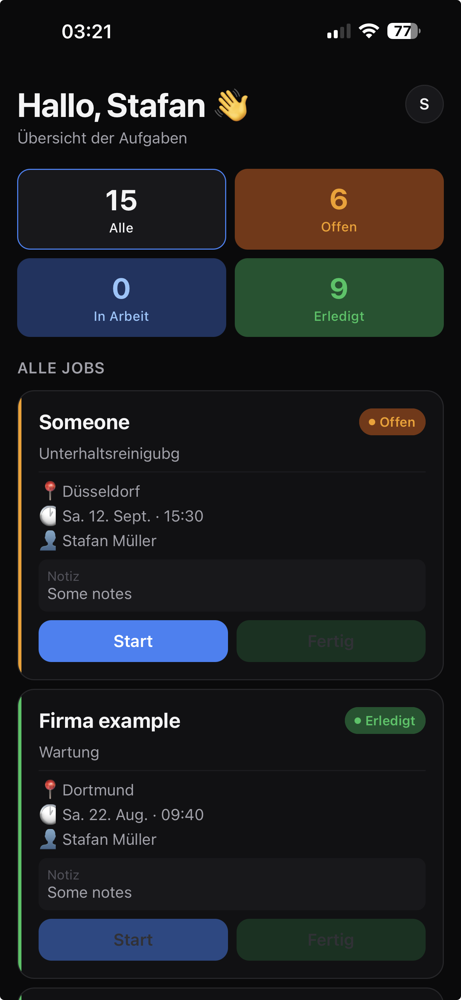
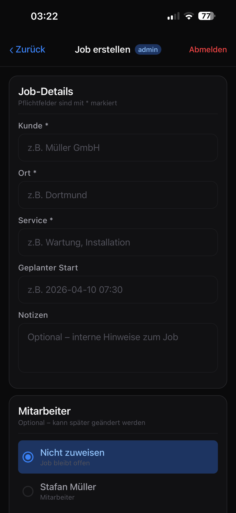

# Cleaning Ops App 🧹

A mobile-first operations app for cleaning companies.

## Features
- Job list for employees
- Start & complete jobs
- Admin panel to create jobs
- Clean architecture (Expo Router + Context)
## 📸 App Screenshots

<p align="center">
  
  
</p>

## Tech Stack
- React Native (Expo)
- TypeScript
- Expo Router
# 🧹 CleanOps — Field Management App for Cleaning Companies

> A mobile-first SaaS application that connects cleaning teams with their daily jobs — in real time.

CleanOps helps cleaning companies ditch the group chats and spreadsheets. Admins create and assign jobs, employees see exactly what they need to do, and everyone stays in sync — automatically.

---

## ✨ Features

### For Employees
- View all assigned jobs at a glance
- Start a job with one tap to mark it as in progress
- Complete jobs and update status in real time

### For Admins
- Create new cleaning jobs with full details
- Assign jobs to specific employees
- Edit or delete jobs at any time
- Monitor the status of every job across the team

### System
- 🔄 Real-time updates powered by Supabase Realtime
- 🔔 Push notifications via Expo Notifications
- 🔐 Role-based navigation (Admin vs. Employee views)
- 🎨 Clean, consistent UI with a custom theme and reusable components
- 📦 Job status flow: `open` → `in_progress` → `completed`

---

## 📱 Screens

| Screen | Role | Description |
|---|---|---|
| Login | Both | Secure email/password login via Supabase Auth |
| Job List | Both | Personalized job feed based on role |
| Job Detail | Both | Full job info, status, and action buttons |
| Create Job | Admin | Form to create and assign a new job |
| Edit Job | Admin | Modify job details or reassignment |
| Admin Dashboard | Admin | Overview of all jobs and their statuses |
| Notifications | Both | Push notification history |

---

## 🛠 Tech Stack

| Layer | Technology |
|---|---|
| Framework | React Native + Expo |
| Language | TypeScript |
| Backend | Supabase (Auth, PostgreSQL, Realtime) |
| Navigation | Expo Router (file-based routing) |
| Notifications | Expo Notifications |
| State / Context | React Context API |

---

## 🗂 Project Structure

```
/app            → All screens and routes (file-based via Expo Router)
/components     → Reusable UI elements (buttons, cards, badges, etc.)
/features       → Feature-specific logic grouped by domain (e.g. jobs, auth)
/context        → Global state providers (e.g. AuthContext, ThemeContext)
/services       → Supabase queries and API communication layer
/types          → TypeScript interfaces and type definitions
/constants      → App-wide constants: colors, fonts, status labels, etc.
```

**Why this structure?**  
Each folder has a single clear responsibility. This makes it easy to find things, test independently, and scale the codebase without things getting messy.

---

## 🚀 Getting Started

### Prerequisites

- Node.js 18+
- Expo CLI (`npm install -g expo-cli`)
- A [Supabase](https://supabase.com) project set up with your schema

### Installation

```bash
# 1. Clone the repo
git clone https://github.com/FerasHB/cleaning-ops-app.git
cd cleaning-ops-app

# 2. Install dependencies
npm install

# 3. Set up your environment variables
cp .env.example .env
# Fill in your Supabase credentials (see below)

# 4. Start the development server
npx expo start
```

Scan the QR code with **Expo Go** on your phone, or press `i` / `a` to open in an iOS/Android simulator.

---

## 🔑 Environment Variables

Create a `.env` file in the root of the project:

```env
EXPO_PUBLIC_SUPABASE_URL=https://your-project.supabase.co
EXPO_PUBLIC_SUPABASE_ANON_KEY=your-anon-key-here
```

> **Why `EXPO_PUBLIC_`?**  
> Expo requires this prefix for any variable that needs to be accessible in client-side code. Never put secret keys here — only use the public anon key.

You can find these values in your Supabase project under **Settings → API**.

---

## 🏗 Architecture Overview

CleanOps follows a clean, layered architecture:

```
UI (screens + components)
        ↓
Features (business logic per domain)
        ↓
Services (Supabase queries)
        ↓
Supabase (Auth + DB + Realtime)
```

- **Screens** only handle display and user interaction
- **Features** contain the logic (e.g. what happens when a job is started)
- **Services** are the only place that talks to Supabase — keeping everything testable and swappable
- **Context** holds global state like the current user and their role
- **Realtime** subscriptions keep the job list updated without any manual refresh

---

## 🗺 Roadmap

- [ ] Filter and search jobs by date, status, or employee
- [ ] Admin analytics dashboard (jobs completed per week, per employee)
- [ ] In-app chat between admin and employee per job
- [ ] Photo upload on job completion as proof of work
- [ ] Multi-company / tenant support
- [ ] Offline mode with sync on reconnect

---

## 👤 Author

**Feras Hababa**  
GitHub: [github.com/FerasHB](https://github.com/FerasHB)

---

> Built with ❤️ using React Native, Expo, and Supabase.