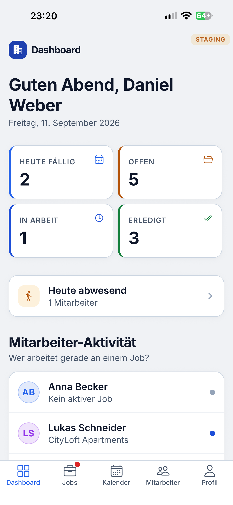
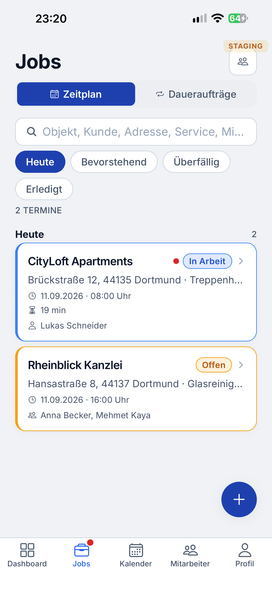
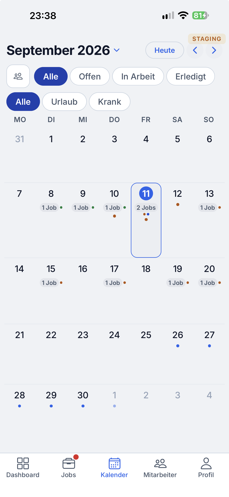
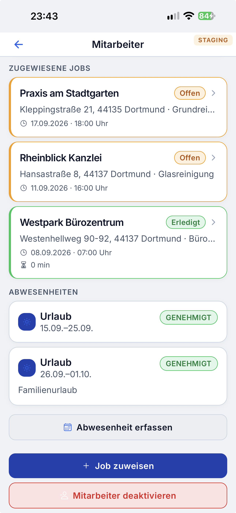
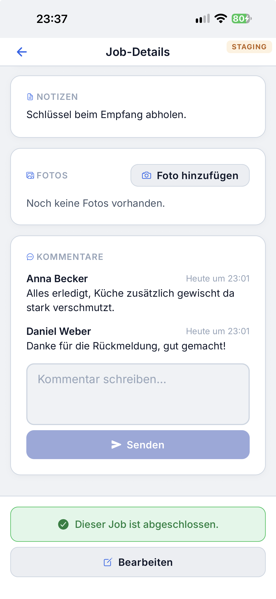
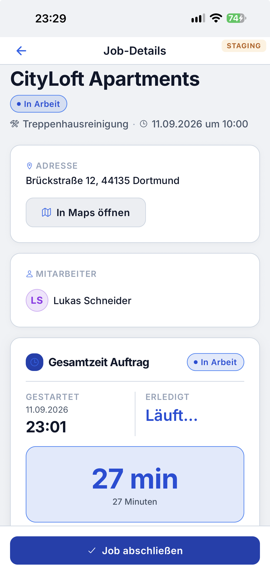
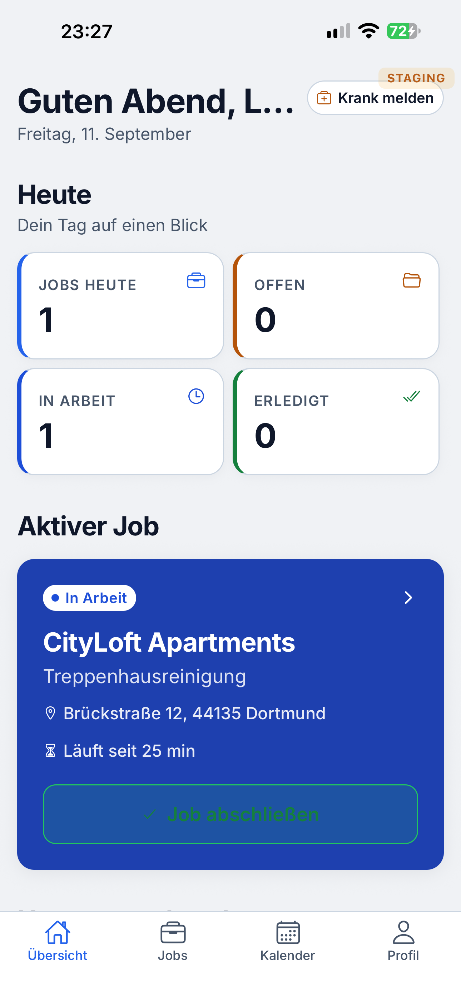
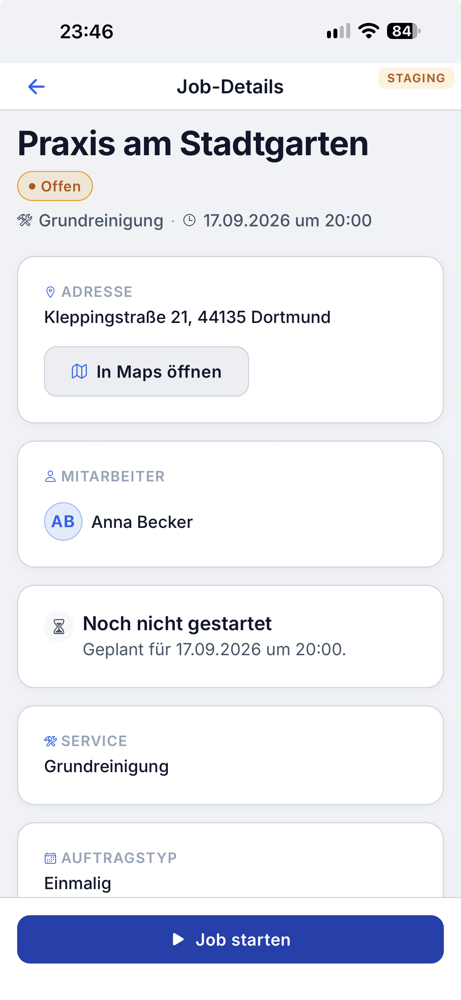
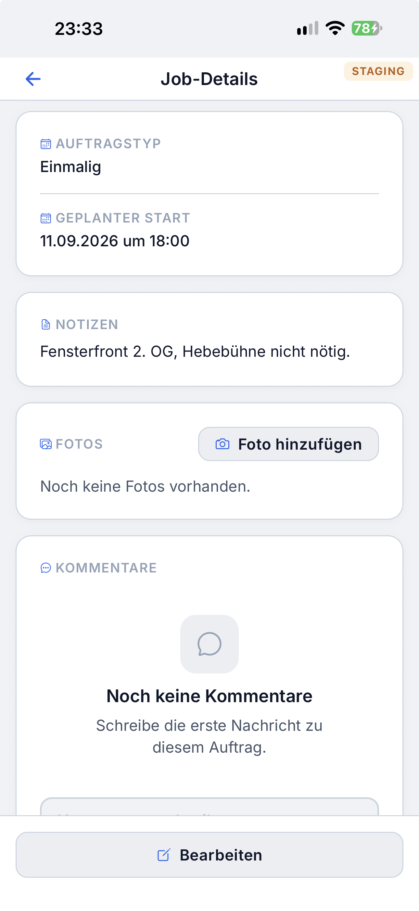

# TaskOps Manager

A production-style mobile app for cleaning companies, built with React Native (Expo) and Supabase. Admins create a company, schedule jobs, and assign staff; field employees see their assigned jobs, start and complete work with a shared job timer, and report comments, photos, and absences — all with offline support for the core job workflow.

The in-app UI and code comments are in German (the target users are German cleaning companies); this document is in English for review purposes.

## Screenshots

Captured from the live app running against a populated Staging environment (fictional demo data — see [Current Status](#current-status)).

| Admin Dashboard | Admin Jobs | Admin Calendar |
|---|---|---|
|  |  |  |

| Employee Detail & Absences | Job Comments | Active Job / Shared Timer |
|---|---|---|
|  |  |  |

<details>
<summary>3 more screenshots (employee overview, job start, job assignment)</summary>

| Employee Overview | Job Details, Not Started | Job Details (Assignment) |
|---|---|---|
|  |  |  |

</details>

## What it does

An admin registers, sets up their company, and adds employees. They create jobs — one-off or recurring by weekday — with a customer, service type, location, schedule, and one or more assigned employees. Employees see their jobs for today and ahead, start a job to begin the shared job timer, complete it when done, leave comments, and attach photos as proof of work. Absences (vacation and sickness) go through a request/approval flow with basic overlap checking. Everything updates in real time across devices, and the core job list keeps working offline, queuing actions until the connection returns.

## Core Features

**Operations**
- Admin dashboard with live KPIs (open / in progress / completed / due today) and a "who's working on what" employee activity feed
- Job creation and editing: one-off jobs (date + time) or recurring jobs (weekdays + time, with an active/paused toggle)
- Multiple employees per job, with per-assignment tracking that survives account deletion (name snapshot)
- Admin and employee calendar views

**Employee Workflow**
- Personalized job list and "today" overview
- Start / Complete actions enforced server-side (RLS + RPC), not just in the UI
- Shared job timer: one official duration per job (`completed_at - started_at`), credited to every assigned employee regardless of who tapped Start/Complete
- Photo upload as proof of work, stored in a private bucket scoped per company/job

**Communication**
- Append-only job comments with author names, visible to admin and all assignees
- Unread-comment indicators, tracked per user per job

**Absence / Vacation**
- Employee self-service vacation requests and sickness reports, with overlap validation
- Admin approval workflow for vacation, including a vacation-day ledger and per-employee entitlement configuration
- Admin can also record an absence manually (e.g. a phone call)

**Scheduling & Timesheets**
- Planned duration per job, worked-time tracking, and a PDF timesheet export for admins

**Notifications**
- Push notifications (Expo Push Service / FCM) on job assignment, status changes, and new comments

**Reliability / Offline**
- Offline queue for job actions (start/complete/etc.) with optimistic UI updates and sync on reconnect
- Realtime sync via Supabase Realtime on the jobs table

**Authentication & Security**
- Supabase Auth with role-based routing (admin vs. employee), password reset, and a minimum password-length policy
- Row Level Security on every table; write paths are re-validated server-side (not just gated in the UI)
- Company contact data (email/phone) with a dedicated update RPC, since the `companies` table has no client-writable UPDATE policy by design

## Tech Stack

| Layer | Technology |
|---|---|
| Framework | React Native 0.81, Expo SDK 54, expo-router 6 (file-based routing) |
| Language | TypeScript |
| Backend | Supabase — Postgres, Auth, Realtime, Storage, Edge Functions (Deno) |
| Push | Expo Notifications |
| Offline | `@react-native-community/netinfo` + AsyncStorage-backed action queue |
| Fonts | Inter (`@expo-google-fonts/inter`) |
| Build/Distribution | EAS Build (development / preview / production profiles), EAS Submit |

## Architecture

- **Role-based access**: every screen and action checks `role` (`admin` | `employee`) from the user's profile, but the UI gate is a convenience — the actual authorization boundary is Postgres Row Level Security and a set of `SECURITY DEFINER` RPCs (e.g. `start_own_job`, `complete_own_job`, `set_job_assignments`, `admin_review_vacation`). A client can't do anything RLS doesn't also allow.
- **Server-side transitions**: job start/complete, vacation approval, and company setup all go through RPCs rather than direct table writes, so business rules (e.g. "a job can't be completed before it's started", "vacation deduction is confirmed, not just computed") are enforced once, in the database.
- **Multi-employee assignments**: a separate `job_assignments` table (not just a single `assigned_to` column) tracks the full assignment set per job, with a name snapshot so history survives account deletion. Two authorization "gates" — one for start/complete, one for comments/photos — are defined once in `utils/jobAssignees.ts` and reused everywhere rather than re-implemented per screen.
- **Recurring jobs as rules, not occurrences**: a recurring job is stored as a single row (weekdays + time), not pre-materialized per-day rows. This is a deliberate MVP scope decision — see [Current Status](#current-status).
- **Offline-first job actions**: job start/complete/edit actions are queued locally when offline, applied optimistically to the UI, and synced against the server on reconnect — while comments and photos are intentionally online-only (append-only, no offline queue).
- **Service layer**: all Supabase calls live in `services/`, mapping DB snake_case rows to camelCase app types; screens never talk to Supabase directly.

## Production-like Engineering

This isn't just a UI prototype — a few things that back that up:

- Separate **Staging** and **Production** Supabase projects, with environment separation enforced at the client (a visible "Staging" badge in non-production builds) and verified before any data-affecting operation
- Every write path is protected by **Row Level Security**, re-checked independently of the UI
- Auth hardening: password length policy, rate limiting, and user-facing German error messages mapped from Supabase's error codes (not raw API text)
- **EAS Build** with separate development/preview/production profiles and a configured App Store Connect submission profile
- Migration-based schema management (`supabase/migrations/`) with accompanying `pgTAP`-style SQL tests (`supabase/tests/`) for RLS and RPC behavior
- Server-side validation of scheduling input (`buildSchedulePayload`) so a single-vs-recurring job can't be created in an inconsistent state, regardless of what the client sends

## Current Status

Active development, currently on a docs/showcase-refresh pass on top of the latest feature work (company contact details). Known, deliberate scope limits:

- **Recurring jobs have no per-day occurrences yet.** A recurring job is one rule; status/timestamps apply to the rule, not to "this Tuesday's cleaning" individually. This is documented, intentional MVP scope, not an oversight.
- **Comments and photos are online-only** by design — no offline queue for those, unlike job start/complete/edit.
- Distribution is via **EAS Build**; an App Store Connect submission profile is configured for iOS.

## Local Development

Requires Node.js 18+ and a Supabase project with the schema in `lib/schema.sql` (reference only — actual schema changes are applied via `supabase/migrations/`).

```bash
git clone https://github.com/FerasHB/cleaning-ops-app.git
cd cleaning-ops-app
npm install
cp .env.example .env
# fill in EXPO_PUBLIC_SUPABASE_URL and EXPO_PUBLIC_SUPABASE_ANON_KEY (publishable/anon key only — never a service-role/secret key)
npm start
```

```bash
npm run ios      # iOS simulator
npm run android   # Android emulator
npm run web       # web (dev only)
npm run lint      # expo lint
```
